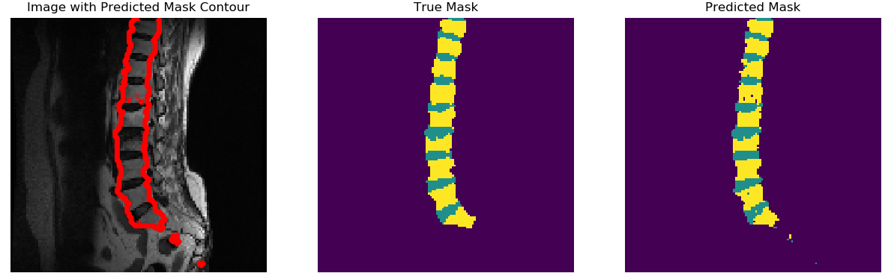

# Rquirements/dependencies: 
### To run this code, you need the following packages:
    1- 1.13.1<=Tensorflow<2.0
    2- Keras
    3- Termcolor
    4- matplotlib
    5- numpy
    6- scikit-learn (sklearn)
    7- Go to requirements folder and copy the tensorflow_examples folder and past it under tensorflow folder in your installation 
    (tensorflow\tensorflow_examples)
------------------------------------

Segmentation of spine MRI slices
------------------------------------
In this work we are building a segmentation network to segment
images of spine. The built model is the u-net model [[ref]](https://lmb.informatik.uni-freiburg.de/people/ronneber/u-net/)
which is comprised of a an encoder network and decoder network. We use the pre-trained
MobileNet_v2 as the encoder and and the decoder is the upsample block 
already implemented in TensorFlow Pix2pix module. **This code runs in eager mode Tensorflow**

### Dataset assumptions 
**We make the following assumptions about the provided dataset**
* *Names of images are aligned with names of masks; however, for generality we do check if this holds true.*
* *Images are already normalized.*

### Repo breakdown
    1- checkpoints folder: contains sample checkpoints and new checkpoints are stored here. 
    2- data_files folder: contains the data files which are images and masks.
    3- model folder: contrain the u-net model.
    4- utils: contrains a helper .py file for visualization and the data loader .py file for loading/pre-processing data from disk
    5- requirements folder: contrains some dependencies to run the code.
    6- main.py : is a runnable python file that allows users to run train or visualize predictions of the u-net model.
    7- training.py: a callable python file invoked by run.py to run the training or visualization code.

### Process pipeline
- User passes training/visualization arguments using the main.py.
- Sanity checks are performed on user input to ensure it is valid before running code.
- Data is loaded from disk and masks and images names are checked if they're matching. Only matching elements are processed.
matched/unmatched number of elements is printed to the screen.
- Data is preprocessed to make it compatible with the used model.
    - Input image channels are extended to 3 to match MobileNetV2 acceptable input.
    - Input images and masks are resized to 224x224 to match MobileNetV2 acceptable input.
- Data is split into training and validation sets.
- DATASET API is used to build a data iterator to be fed to the model.
- Model is compiled and summary is printed to the screen.
- If training mode is set to visualizaiton or train from an existing checkpoint, the model is loaded with
a provided checkpoint.
- Model is then fit for training if training mode is not visualizaiton only.

### main.py arguments:
    1. '-b', '--batch_size', default=2, type=int, help='Batch size between 1 & 15 -- default: 2 '
    2. '-t', '--train_mode', default=0, type=int, help='0: Predict, 1: Train from a previous checkpoint, 2: Train from scratch -- default: 0'
    3. '-v', '--visualize', default=0, type=int, help='0: Visualize training samples, 1: visualize validation samples -- default: 0'
    4. '-e', '--training_epochs', default=2, type=int, help='-- default: 2'
    5. '-k', '--ckpt_path', default='checkpoints\pre_trained.h5', type=str, help='(Optional, provide path to checkpoints in case of '
                            'train_mode = 0 or 1) -- default: checkpoints\pre_trained.h5'
    6. '-i', '--images_path', default='data_files\images', type=str, help='(Optional, provide path to input images in case of '
                        'training on a different dataset - must be .png) -- default: data_files\images'
    7. '-m', '--masks_path', default='data_files\masks', type=str, help='(Optional, provide path to input masks in case of '
                        'training on a different dataset - must be .npy) -- default: data_files\masks'
                            
                            
                            
## How to use
* Visualize validation predictions: **python3 main.py -v 1**
* Train from scratch for 10 epochs: **python3 main.py -t 2 -e 10**
* Train from an existing checkpoint for 5 epochs: **python3 main.py -t 1 -e 5**
       
    
                       
### Created by: Muhammad Hamdan	 
